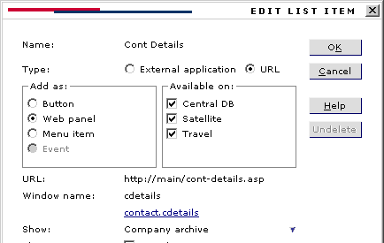

Links in Web Panels Can Switch Panels
=====================================

Clicking on the **Go to Project** link will switch to the Project panel.

The window names you define in the admin client can be used in the HTML you load a link into a specific panel.

The &lt;A HREF="..."&gt; command can take a TARGET="..." parameter, which can specifiy which browser the link should be displayed in.

You have two web panels: one with a window name "contact.cdetails" and another with the window name "project.pdetails" (the names are “cdetails” and “pdetails”, since they can’t both be called “details”).

## Admin Web Panels

The window name is the blue underlined name in the application dialog. In this case: "contact.cdetails"

You can have a link in the contact page that displays and loads the project details web panel with a new page. In the contact web panel you have this HTML:

&lt;a href="list-project-info.asp?prid=123" **target="project.pdetails"**&gt;Show project info&lt;/a&gt;

When the user clicks the link, the target info will cause the browser to load the page into the other browser panel.

The fact that the other browser panel has been updated will cause the windows client to switch to the correct project browser panel.

You can use this mechanism to switch to any browser panel you have defined in the admin client. Just make sure you use the correct form of the window name.

Add a Web page to upper or lower part of contact or project panels.

Web page can be sent information about current contact, current person, current project using document template variables.

i.e. 

* &lt;name&gt; = current contact name
* &lt;orgn&gt;  = organization number
* &lt;cuid&gt;  = contact\_id
* &lt;pnam&gt;  = project name
* &lt;prid&gt;  = project id

The admin documentation has the complete list.
We put these template variables into the URL when we define the application in the Admin client.

http://intranet/report/sales.asp?orgnum=&lt;orgn&gt;

Note that you have to write sales.asp so that it does something useful with the orgnum parameter.