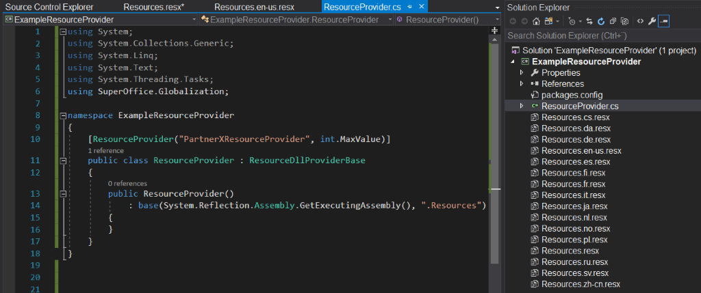

# Resource Providers

Resource providers are a single mechanism to ask for text and receive it in any supported culture. A text resources uses a unique key that accesses a language specific value stored in a resources file, or satellite assembly.

SuperOffice supports approximately 15 languages and it's important to optimize text resources for labels, tooltips and error messages in all of those languages.

To minimize duplication, mistakes or inconsistancies, all SuperOffice products leverage NetServer resource providers for providing text resources.

All existing resource string keys are defined in the [SuperOffice NetServer Core documentation](https://community.superoffice.com/documentation/SDK/SO.NetServer.Data.Access/html/T_SuperOffice_Globalization_RC.htm).

## Example Resource Use

Throughout the SuperOffice CRM.web application, string resources are extensivly whereever common text appears. Below is an example from the SoContactPanel.config file.

The CRM.web application UI is decared in SuperOffice Markup Language (SOML) configuration files, where the UI elements are declared using XML. Resource strings are used a lot and appear obvious everywhere there is text inside sqare brackets. The example is even more recognizable by the binding attribute ```binding="resources"```.

``` xml

<view id="more" type="SoView" soprotocol="udef" current="contact" rendermode="display" ...>
    <caption binding="resources">[SR_MORE_CONTACT]</caption>
    <tooltip binding="resources">[SR_MORE_TOOLTIP]</tooltip>
...
```

## How to Create a Resource Provider

All resource providers must be compiled in .net assemblies. SuperOffice provider a base class in the _SuperOffice.Plugins.dll_, located in the __SuperOffice.Globalization__ namespace, called __ResourceDllProviderBase__, which makes it easy to get started.

Implementations must decorate the class with the  __ResourceProvider__ attribute, which NetServer will use to discover and load at runtime. The first parameter must be a name that uniquely identifies your provider. The second parameter is a priority number that can force your provider to be called before others, and thus override already-existing stuff. This is not normally a recommended practice, however the lowest priority value is used first. SuperOffice default priority values are int.MaxValue divided by 2. If another provider that includes the same resource names with a lower priority value, such as _int.MaxValue / 3_, it takes precedence and overrides default resources supplied by SuperOffice.

The constructor expects two parameters; the name of the executing assembly and the name of the resx resource files that contains the language specific text resources.

## Code Example

``` csharp

[ResourceProvider( "PartnerXResourceProvider", int.MaxValue )]
public class ResourceProvider : ResourceDllProviderBase
{
    public ResourceProvider()
        : base( System.Reflection.Assembly.GetExecutingAssembly(), ".Resources" )
    {
    }
}

```

## Dependencies

Assemblies must declared in the applications configuration file. The key here is not special or mapped to anything else. It only needs to unique from other assemblies declared in the DynamicLoad section. The value must be the name of the resource assembly.

The value is optionally a full path, or when placed in the applications directory only needs to be the name of the assembly.

``` xml
<SuperOffice>
    ...
    <Factory>
        <DynamicLoad>
        ...
            <!-- Add custom plugins etc here -->
            <add key="UniqueName" value="UniqueName.Resources.dll" />
        </DynamicLoad>
    </Factory>
    ...
</SuperOffice>

```

## Example .NET Project

In the example below, the project uses the Nuget Package __SuperOffice.NetServer.Core__ to easily get a reference to the _SuperOffice.Plugins.dll_.



## Resource Codes

|Abbreviation       | Country               |
|-------------------|-----------------------|
|cs|Czech (Czech Republic)|
|da|Danish|
|de|German|
|en-us| English - United States|
|es| Spanish|
|fi|Finnish|
|fr|French|
|it|Italian|
|ja|Japanese|
|nl|Dutch|
|no|Norwegian|
|pl|Polish|
|default (see image)|English - United Kingdom|
|ru|Russian|
|sv|Swedish|
|zh-cn|Chinese (S)|

## Do It Yourself

If you have special requirements, implement the IResourceProvider interface, or override the base class implementation; the methods CanInitialize(), Initialize(); GetSupportedLanguages(); GetResource(string symbol) are easy to understand and implement.

The idea behind CanInitialize is that some providers may need database access, and so they should not be initialized too early. By doing a quick check and returning true only when everything is ready, you can postpone the initialization to the correct moment.