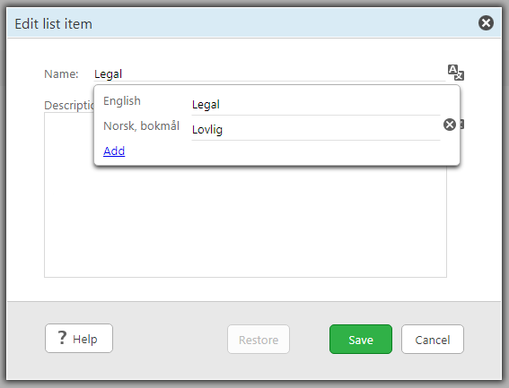
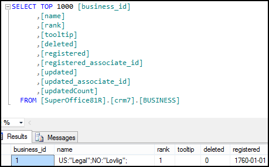

# CultureDataFormatter

This is a helper class used to encode, parse and reformat culturally sensitive data used throughout SuperOffice. Additionally, MDO lists such as Business and Category often contain delimited multicultural strings that require parsing. In the administration pages of SuperOffice, an MDO Item is easily edited in an MDO Item dialog.



As seen in the database, the record is stored as:



Using CultureDataFormatter

The following code demonstrates how to look up the Business MDO List items. The output of the name contains the complete multicultural string as seen in the database.

```csharp

ISoListProvider provider = SuperOffice.CRM.Lists.SoListProviderFactory.Create("business");

foreach (var item in provider.RootItems)
{
    Debug.WriteLine(item.Name);

    // outputs:
    // "US:\"Legal\";NO:\"Lovlig\";"
}

```

The following code demonstrates how to use the CultureDataFormatter class to extract the cultural value using a language code.

```csharp

ISoListProvider provider = SuperOffice.CRM.Lists.SoListProviderFactory.Create("business");

foreach (var item in provider.RootItems)
{
    var engName = CultureDataFormatter.ParseMultiLanguageString(item.Name, "en-US");

    // outputs:
    // "Legal"
}

```

---

## Encoded Values

With core NetServer, the archive row column data contains a RawValue property of type Object, and can safely be cast to the appropriate type. However, when using NetServer web services it depends on whether you are using SuperOffice proxies or not. If you are, the RawValue property contains the column value. If not, only the DisplayValue exists and all values are returned encoded.

With the exception of string column values, DisplayValue always contains an encoded string. The SuperOffice.CRM.Globalization.CultureDataFormatter class knows how to handle these values and simply parses and returns the column value in the correct data type.

An encoded value is always a string of characters in the format: [data-type-marker : value], i.e. [I:3]. Columns that are of type string will never be in an encoded format.

The data type marker indicates the column data type followed by a colon, then the column data value. The following table lists all encodings.

|Data Type  |Marker |Example|
|-----------|--------|-------|
|Binary |B  |[B:X98…]|
|Date   |D  |[D:09.11.2017]|
|DateTime|DT    |[DT:11/09/2017 14:53:18]|
|Double, Decimal|F  |[F:123.4]|
|Int    |I  |[I:123]|
|Money  |M  |[M:123.45]|
|Time   |T  |[T:14:52]|
|String |   |“Not encoded”|

For each data type, CultureDataFormatter has a static Encode and ParseEncoded method, for example:

```csharp
// encode

string = CultureDataFormatter.EncodeInt(int);

// decode

int = CultureDataFormatter.ParseEncodedInt(string);
```

Data values passed into NetServer do not need to be encoded, NetServer knows how to detect and process them accordingly.
