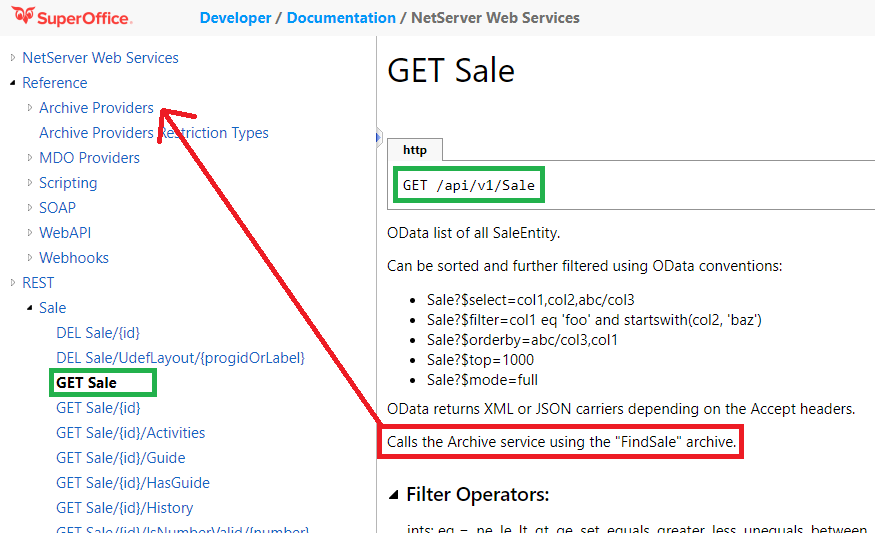
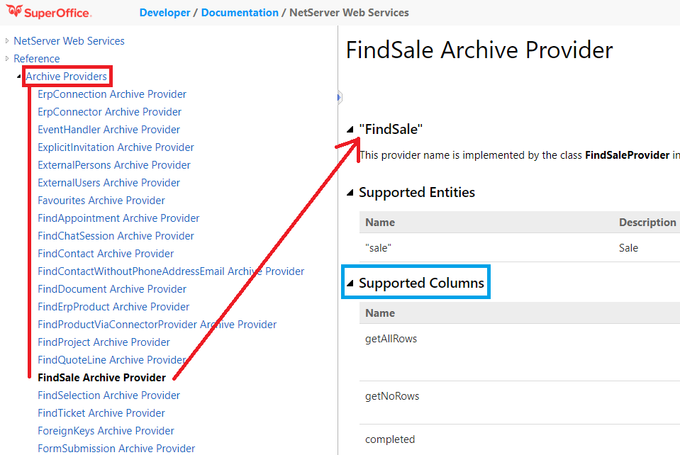
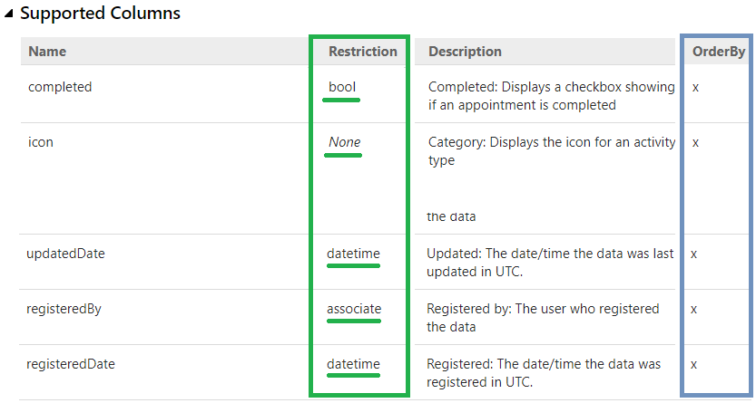

## How to search SuperOffice

SuperOffice REST API's expose search endpoints that API consumers use to submit search queries.

Examples of these endpoints are:

```c
/api/v1/Appointment
/api/v1/Contact
/api/v1/Person
/api/v1/Sale
```

Each endpoint, accessed by a GET request without parameters, is expected to be an [OData URI](https://www.odata.org/) query.

### OData

The OData URI's are expected in a structured query format, which are then server-side transformed into data structures understood by [archive providers](https://community.superoffice.com/en/content/content/netserver-sdk/netserver-archive-providers/).

`/api/v1/contact?$select=field1,field2&$filter=contactId eq 5`

-root---/-resource-/-query options ----------------------/

---

An OData URI accepts any number of the following options that are used to formulate logical database queries.

| Options | Type                   | Description                                                                                                                                                    |
|----------------|------------------------|----------------------------------------------------------------------------------------------------------------------------------------------------------------|
| $select        | string                 | Comma separated list of column names to return. "nameDepartment,fullname,category". Can also use aggregation functions and modifiers: "Count(category):Footer" |
| $filter        | string                 | Expression to restrict the results. e.g.: "name begins 'foo' and category gt 1"                                                                                |
| $orderBy       | string                 | Comma separated list of column names to sort by, with optional direction. "name asc,fullname,category desc"                                                    |
| $entities      | string                 | Comma separated list of entity names to use. Default = "". "contact, person"                                                                                   |
| $top           | int32                  | Number of rows to return in results                                                                                                                            |
| $skip          | int32                  | Number of rows from database to skip before returning results                                                                                                  |
| $mode          | Enum: Slim, Full       | FULL (with raw values and hints for each value) or SLIM (just the display values)                                                                              |
| $options       | string                 | Provider specific options. e.g: "GrandTotal=true"                                                                                                              |
| $context       | string                 | Provider specific context parameter.                                                                                                                           |
| $format        | string                 | Set XML or JSON output format; override the format determined from Accept header.                                                                              |
| $jsonSafe      | bool                   | Make output names into JSON safe property names. Replace all unsafe characters with _ underscore.                                                              |
| $output        | Enum: Logical, Display | Return Logical or Display values in SLIM mode. Logical returns true/false for booleans, Display returns icon hints. Dates are always returned as ISO strings.  |

### The OData - Archive Provider connection

Because every OData query performs a search using an [Archive Provider](https://community.superoffice.com/en/content/content/netserver-sdk/netserver-archive-providers/), it's important to understand the relationship between the OData query options and how that structure gets transformed into something the underlying archive provider can understand. 

OData queries provides the means to submit a query with `SELECT` columns, `WHERE` criteria, `ORDER BY` instructions and paging information.

Looking at the Sale endpoint, select the GET Sale node. In addition to providing clues how to construct an OData query, these pages all detail which archive provider is used by the endpoint to perform the query. 

The name of the archive provider is located just above the Filter section. Locate the paragraph that begins with _"Calls the Archive service using the `"{ArchiveProvider}"` archive."_ The name of the archive provider matches one that is listed in the Archive Provider pages. 

The GET Sale endpoint uses the **FindSale** archive provider.



### $select columns

All available columns, shown under the blue rectangle, are listed under the **Supported Columns** text on the FindSale archive provider page.



Archive provider pages also list the column datatypes and whether or not the column can by used in an `ORDER BY` statement.



### $filter operators

Difference data types can have different operators. Each OData search page contains a table of data types and their associated operators.

| Data type | Description                                                                 |
|-----------|-----------------------------------------------------------------------------|
| Boolean   | set                                                                         |
| Numbers   | eq, ne, lt, gt, set, equals, greater, less, unequals, between               |
| String    | begins, between, contains, is, notBegins, notContains, isNot                |
| Date      | before, date, after, between \| dateBetween                                 |
| DateTime  | dateTime, beforeTime, afterTime                                             |
| Days      | beforeToday, today, afterToday                                              |
| Weeks     | lastWeek, thisWeek, nextWeek                                                |
| Months    | lastMonth, thisMonth, nextMonth                                             |
| Quarter   | lastQuarter, thisQuarter, nextQuarter                                       |
| Year      | thisHalf, thisYear                                                          |
| Associate | associateIsOneOf, associateIsNotOneOf, currentAssociate                     |
| Lists     | equals, oneOf, notOneOf                                                     |

## Examples

### Select all companies

```http
GET /api/v1/contact?$select=name,associateId,contactAssociate/fullName HTTP/1.1
Authorization: Bearer 8A:
Content-Type: application/json
Accept: application/json
```

### Boolean

```http
GET /api/v1/contact?$select=name,associateId,contactAssociate/fullName&$filter=hasInterests set true HTTP/1.1
Authorization: Bearer 8A:
Content-Type: application/json
Accept: application/json
```

### String

#### Begins with

```http
GET /api/v1/contact?$select=name,associateId,contactAssociate/fullName&$filter=name begins 'S' HTTP/1.1
Authorization: Bearer 8A:
Content-Type: application/json
Accept: application/json
```

#### Equals (is)

```http
GET /api/v1/contact?$select=name,associateId,contactAssociate/fullName&$filter=name is 'Testing null Orgnr' HTTP/1.1
Authorization: Bearer 8A:
Content-Type: application/json
Accept: application/json
```

#### Contains

```http
GET /api/v1/contact?$select=name,associateId,contactAssociate/fullName&$filter=name contains 'Orgnr' HTTP/1.1
Authorization: Bearer 8A:
Content-Type: application/json
Accept: application/json
```

#### Not Begins

```http
GET /api/v1/contact?$select=name,associateId,contactAssociate/fullName&$filter=name notBegins 'S' HTTP/1.1
Authorization: Bearer 8A:
Content-Type: application/json
Accept: application/json
```

#### Not Contains

```http
GET /api/v1/contact?$select=name,associateId,contactAssociate/fullName&$filter=name notContains 'Owl' HTTP/1.1
Authorization: Bearer 8A:
Content-Type: application/json
Accept: application/json
```

#### Is Not

```http
GET /api/v1/contact?$select=name,associateId,contactAssociate/fullName&$filter=name isNot 'SuperOffice Software Limited' HTTP/1.1
Authorization: Bearer 8A:
Content-Type: application/json
Accept: application/json
```

#### Between

```http
GET /api/v1/contact?$select=name,associateId,contactAssociate/fullName&$filter=name between ('A','S') HTTP/1.1
Authorization: Bearer 8A:
Content-Type: application/json
Accept: application/json
```

### Numbers (integer, decimal, float)

#### Equals

```http
GET /api/v1/contact?$select=name,associateId,contactAssociate/fullName&$filter=contactId = 5 HTTP/1.1
Authorization: Bearer 8A:
Content-Type: application/json
Accept: application/json
```

```http
GET /api/v1/contact?$select=name,associateId,contactAssociate/fullName&$filter=contactId eq 2 HTTP/1.1
Authorization: Bearer 8A:
Content-Type: application/json
Accept: application/json
```

```http
GET /api/v1/contact?$select=name,associateId,contactAssociate/fullName&$filter=contactId equals 5 HTTP/1.1
Authorization: Bearer 8A:
Content-Type: application/json
Accept: application/json
```

```http
GET /api/v1/contact?$select=name,associateId,contactAssociate/fullName&$filter=contactId set 5 HTTP/1.1
Authorization: Bearer 8A:
Content-Type: application/json
Accept: application/json
```

#### Not equals

```http
GET /api/v1/contact?$select=name,associateId,contactAssociate/fullName&$filter=contactId ne 2 HTTP/1.1
Authorization: Bearer 8A:
Content-Type: application/json
Accept: application/json
```

#### Less than

```http
GET /api/v1/contact?$select=name,associateId,contactAssociate/fullName&$filter=contactId lt 5 HTTP/1.1
Authorization: Bearer 8A:
Content-Type: application/json
Accept: application/json
```

```http
GET /api/v1/contact?$select=name,associateId,contactAssociate/fullName&$filter=contactId less 5 HTTP/1.1
Authorization: Bearer 8A:
Content-Type: application/json
Accept: application/json
```

#### Greater than

```http
GET /api/v1/contact?$select=name,associateId,contactAssociate/fullName&$filter=contactId gt 5 HTTP/1.1
Authorization: Bearer 8A:
Content-Type: application/json
Accept: application/json
```

```http
GET /api/v1/contact?$select=name,associateId,contactAssociate/fullName&$filter=contactId greater 5 HTTP/1.1
Authorization: Bearer 8A:
Content-Type: application/json
Accept: application/json
```

#### Not equal to

```http
GET /api/v1/contact?$select=name,associateId,contactAssociate/fullName&$filter=contactId unequals 5 HTTP/1.1
Authorization: Bearer 8A:
Content-Type: application/json
Accept: application/json
```

### Dates

#### Get All

```http
GET /api/v1/appointment?$select=type,text,contact/name HTTP/1.1
Authorization: Bearer 8A:
Content-Type: application/json
Accept: application/json
```

#### Before date

```http
GET /api/v1/appointment?$select=date,type,text,contact/name?&$filter=date before '2020-05-28' HTTP/1.1
Authorization: Bearer 8A:
Content-Type: application/json
Accept: application/json
```

#### After date 

```http
GET /api/v1/appointment?$select=type,text,contact/name?&$filter=date after '2020-05-28' HTTP/1.1
Authorization: Bearer 8A:
Content-Type: application/json
Accept: application/json
```

#### On Date

```http
GET /api/v1/appointment?$select=date, type,text,contact/name?&$filter=date date '2020-05-28' HTTP/1.1
Authorization: Bearer 8A:
Content-Type: application/json
Accept: application/json
```

#### Between dates

```http
GET /api/v1/appointment?$select=date, type,text,contact/name?&$filter=date between ('2020-05-11','2020-05-31') HTTP/1.1
Authorization: Bearer 8A:
Content-Type: application/json
Accept: application/json
```

#### Before or Equal date

```http
GET /api/v1/appointment?$select=type,text,contact/name?&$filter=date beforeOrEqual '2020-05-28' HTTP/1.1
Authorization: Bearer 8A:
Content-Type: application/json
Accept: application/json
```

### DateTime

#### Equals DateTime

```http
GET /api/v1/appointment?$select=date,type,text,contact/name?&$filter=date dateTime '2020-05-28T15:00:00' HTTP/1.1
Authorization: Bearer 8A:
Content-Type: application/json
Accept: application/json
```

#### Before DateTime

```http
GET /api/v1/appointment?$select=date,type,text,contact/name?&$filter=date beforeTime '2020-05-28T15:00:00' HTTP/1.1
Authorization: Bearer 8A:
Content-Type: application/json
Accept: application/json
```

#### After DateTime

```http
GET /api/v1/appointment?$select=date,type,text,contact/name?&$filter=date afterTime '2020-05-28T15:00:01' HTTP/1.1
Authorization: Bearer 8A:
Content-Type: application/json
Accept: application/json
```

### Unary Day

#### Before Today

```http
GET /api/v1/appointment?$select=date,type,text,contact/name?&$filter=date beforeToday HTTP/1.1
Authorization: Bearer 8A:
Content-Type: application/json
Accept: application/json
```

#### On Today

```http
GET /api/v1/appointment?$select=date,type,text,contact/name?&$filter=date today HTTP/1.1
Authorization: Bearer 8A:
Content-Type: application/json
Accept: application/json
```

#### After Today

```http
GET /api/v1/appointment?$select=date,type,text,contact/name?&$filter=date afterToday HTTP/1.1
Authorization: Bearer 8A:
Content-Type: application/json
Accept: application/json
```

### Unary Weeks

### Last Week

```http
GET /api/v1/appointment?$select=date,type,text,contact/name?&$filter=date lastWeek HTTP/1.1
Authorization: Bearer 8A:
Content-Type: application/json
Accept: application/json
```

#### This Week

```http
GET /api/v1/appointment?$select=date,type,text,contact/name?&$filter=date thisWeek HTTP/1.1
Authorization: Bearer 8A:
Content-Type: application/json
Accept: application/json
```

#### Next Week

```http
GET /api/v1/appointment?$select=date,type,text,contact/name?&$filter=date nextWeek HTTP/1.1
Authorization: Bearer 8A:
Content-Type: application/json
Accept: application/json
```

### Unary Months

### Last Month

```http
GET /api/v1/appointment?$select=date,type,text,contact/name?&$filter=date lastMonth HTTP/1.1
Authorization: Bearer 8A:
Content-Type: application/json
Accept: application/json
```

#### This Month

```http
GET /api/v1/appointment?$select=date,type,text,contact/name?&$filter=date thisMonth HTTP/1.1
Authorization: Bearer 8A:
Content-Type: application/json
Accept: application/json
```

#### Next Month

```http
GET /api/v1/appointment?$select=date,type,text,contact/name?&$filter=date nextMonth HTTP/1.1
Authorization: Bearer 8A:
Content-Type: application/json
Accept: application/json
```

### Unary Quarters

#### Last Quarter

```http
GET /api/v1/appointment?$select=date,type,text,contact/name?&$filter=date lastQuarter HTTP/1.1
Authorization: Bearer 8A:
Content-Type: application/json
Accept: application/json
```

#### This Quarter

```http
GET /api/v1/appointment?$select=date,type,text,contact/name?&$filter=date thisQuarter HTTP/1.1
Authorization: Bearer 8A:
Content-Type: application/json
Accept: application/json
```

#### Next Quarter

```http
GET /api/v1/appointment?$select=date,type,text,contact/name?&$filter=date nextQuarter HTTP/1.1
Authorization: Bearer 8A:
Content-Type: application/json
Accept: application/json
```

### Unary Years

### This Half

```http
GET /api/v1/appointment?$select=date,type,text,contact/name?&$filter=date thisHalf HTTP/1.1
Authorization: Bearer 8A:
Content-Type: application/json
Accept: application/json
```

#### This Year

```http
GET /api/v1/appointment?$select=date,type,text,contact/name?&$filter=date thisYear HTTP/1.1
Authorization: Bearer 8A:
Content-Type: application/json
Accept: application/json
```

### Associate

#### Associate Is One Of

```http
GET /api/v1/contact?$select=name,associateId&$filter=registeredBy associateIsOneOf (1,6) HTTP/1.1
Authorization: Bearer 8A:
Content-Type: application/json
Accept: application/json
```

#### Associate Is Not One Of

```http
GET /api/v1/contact?$select=name,associateId&$filter=registeredBy associateIsNotOneOf (1,6) HTTP/1.1
Authorization: Bearer 8A:
Content-Type: application/json
Accept: application/json
```

### Lists

#### Equals

```http
GET /api/v1/contact?$select=name,associateId&$filter=category equals 4 HTTP/1.1
Authorization: Bearer 8A:
Content-Type: application/json
Accept: application/json
```

#### One Of

```http
GET /api/v1/contact?$select=name,associateId&$filter=category oneOf (3,6) HTTP/1.1
Authorization: Bearer 8A:
Content-Type: application/json
Accept: application/json
```

#### Not One Of

```http
GET /api/v1/contact?$select=name,associateId,category&$filter=category notOneOf (3,6) HTTP/1.1
Authorization: Bearer 8A:
Content-Type: application/json
Accept: application/json
```